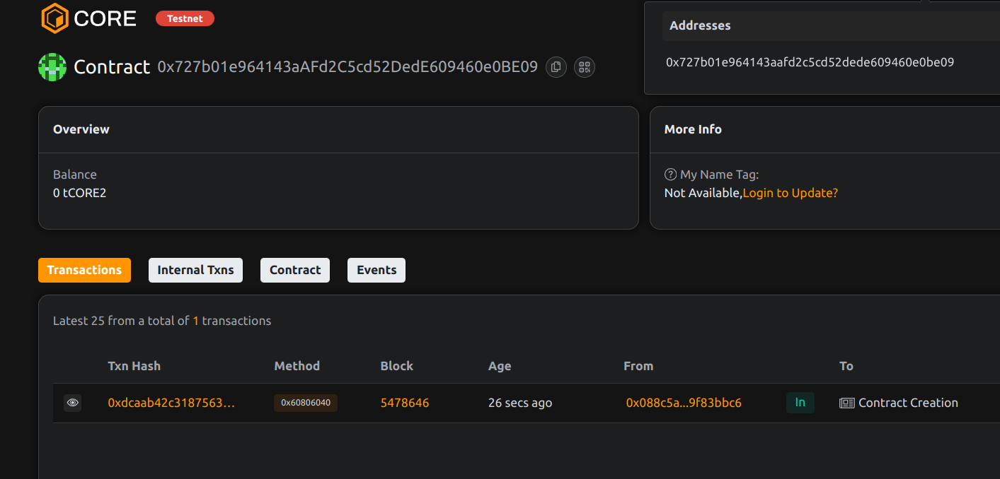

# SmartRoyalty – Real-Time Royalty Distribution for Digital Creators

## 📄 Project Description

SmartRoyalty enables digital creators to automatically distribute earned revenue to collaborators, producers, or stakeholders as soon as payments are received.

## 🎯 Project Vision

To bring financial transparency and automation to the digital content economy by removing manual royalty calculations and delays.

## ✨ Key Features

- ⚖️ On-chain royalty distribution logic
- ⏱ Real-time revenue splitting
- 🧮 Configurable share percentages
- 👥 Supports multiple recipients per content

## 🔮 Future Scope

- NFT integration for creator rights
- Streaming payment support (Sablier-style)
- Royalty dashboards and analytics
- Cross-chain royalty flows

## 📜 Contract Details
0x727b01e964143aAFd2C5cd52DedE609460e0BE09
